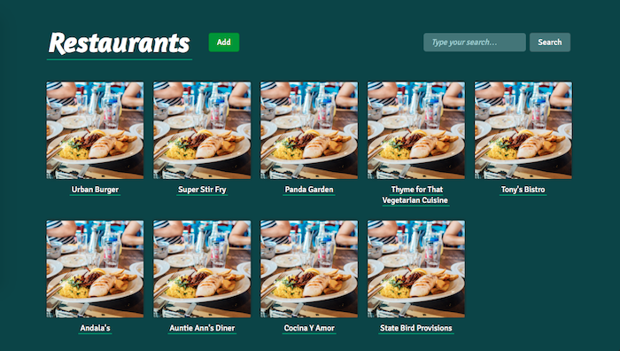
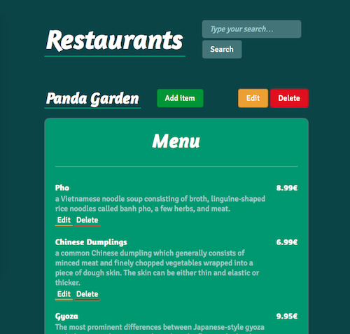

# Full Stack Foundations

This is the repository I used while following the [Full Stack Foundations](https://classroom.udacity.com/courses/ud088/) course at Udacity.

## Restaurants app

The app developed here is a very simple restaurant and menu management system. It involves :

- A Flask backend application, managing the views and providing API endpoints to the database of restaurants and menu items ;
- An HTML5/CSS3, SASS-powered frontend for styling and layout.

